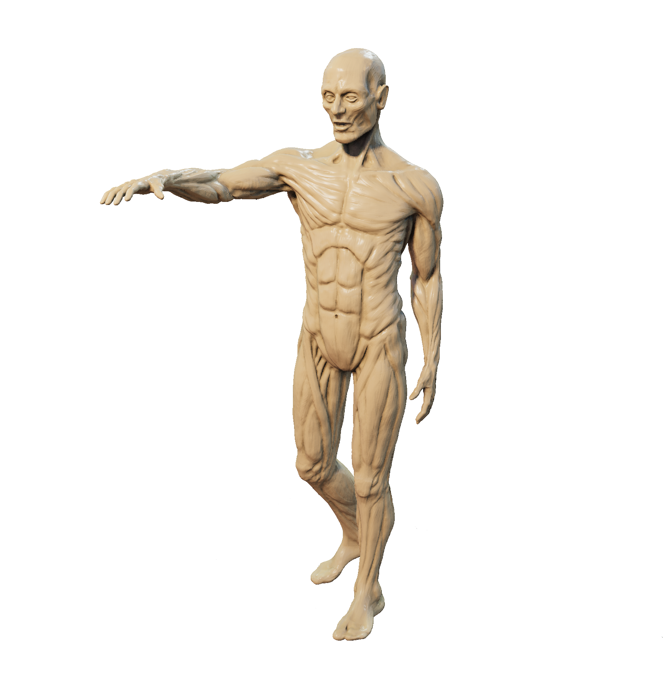
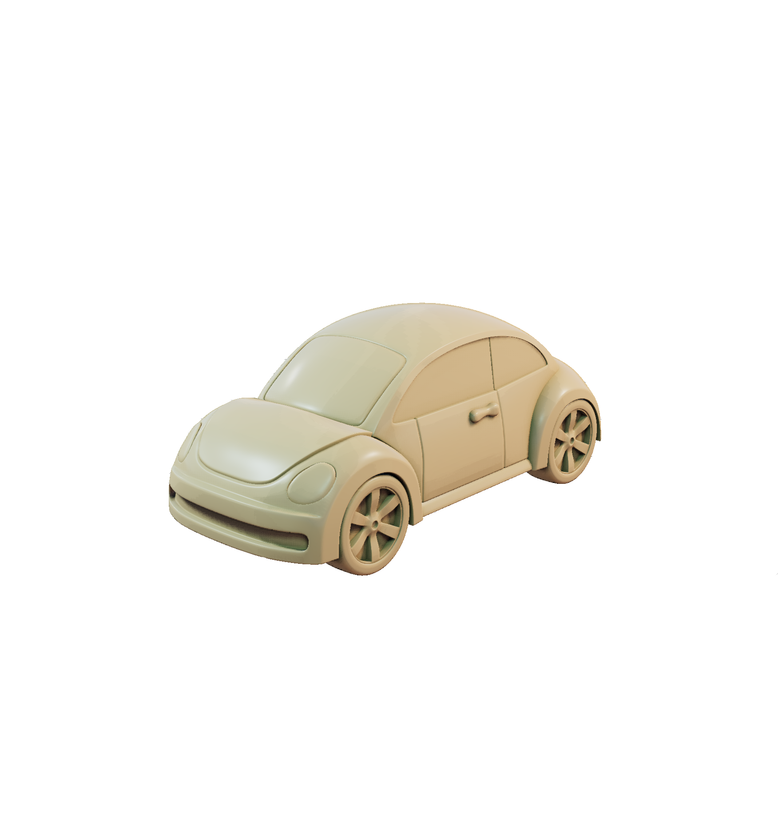
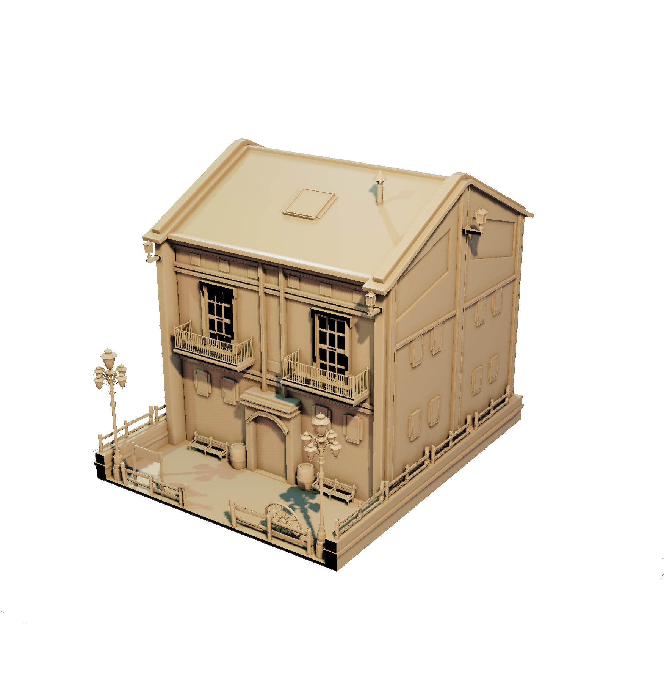

# EasyPBR

<p align="middle">
  
   
  
</p>

EasyPBR is a lightweight Physically-Based Renderer designed for ease of use and fast prototyping. It abstracts away most of the complexity of rendering allowing the user to display high quality images in only a couple of lines of code. The whole rendering process is fully controllable through either a Python script or C++ program. EasyPBR is written in C++ and OpenGL and provides Python bindings to most of it's functionality.

<!--  |  -->


# Example
    from easypbr  import *
    
    view=Viewer.create("default_params.cfg")
    mesh = Mesh("./data/lucy.obj")
    Scene.show(mesh, "mesh")
    
    while True:
        view.update()

# Features
- Deferred rendering 
- Physically-based shading
- Screen Space Ambient Occlusion (SSAO)
- Shadow Mapping with Percentage Closer Filtering for soft shadows
- Image Based Lighting (IBL) using HDR maps
- Eye Dome Lighting for point cloud rendering
- Various tonemapping operators (Rheinhard, Unreal, ACES)
- Shader hotloading 
- Various modes of visualization (mesh, wireframe, point cloud, surfel)
- Loading of multiple meshes formats (.obj, .ply, .pcd, .off)
- Drag and drop of meshes and HDR maps directly in the viewer
- Easy extension and usage from other packages

# Install 
### Dependencies:
```sh
$ sudo apt-get install python3-pip python3-setuptools libglfw3-dev libboost-all-dev libeigen3-dev libpcl-dev python3-opencv
```
### Optional dependencies: 
Allow for shader hotloading, so changes to .glsl files are automatically recompiled and used while the program is running:
```sh   
$ sudo apt-get install libkqueue-dev
```

### Build and install: 
```sh
$ ./build_and_install.sh
```

