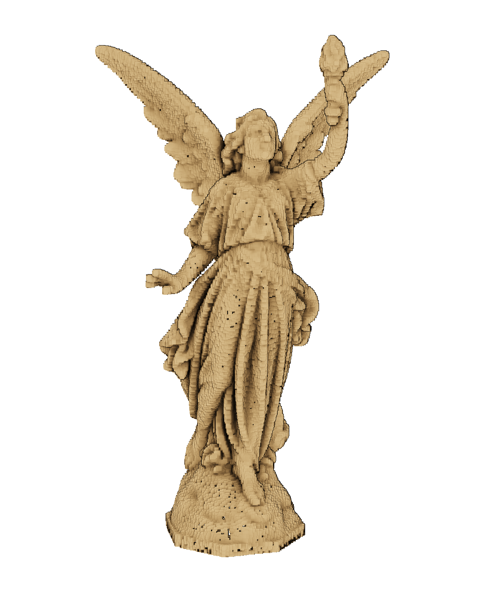
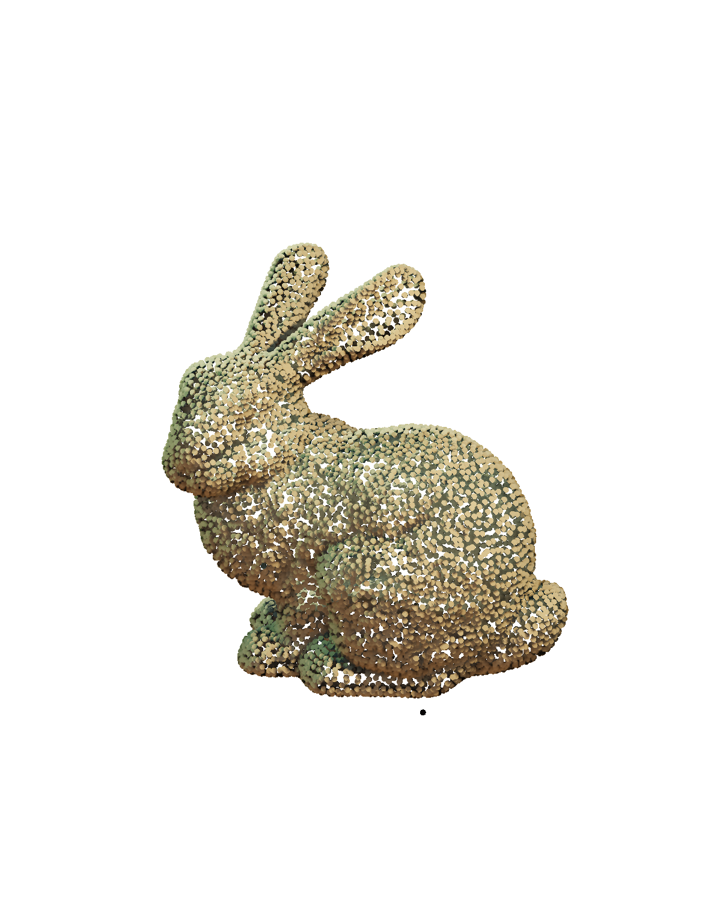
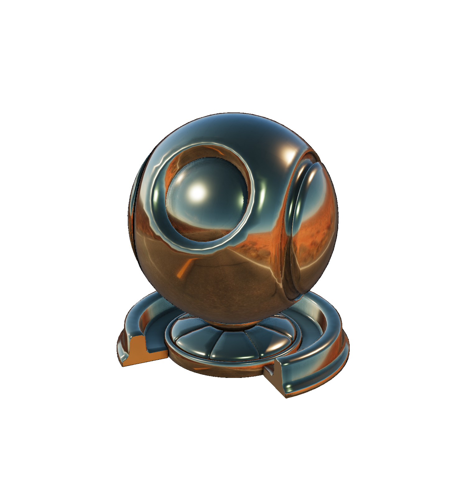
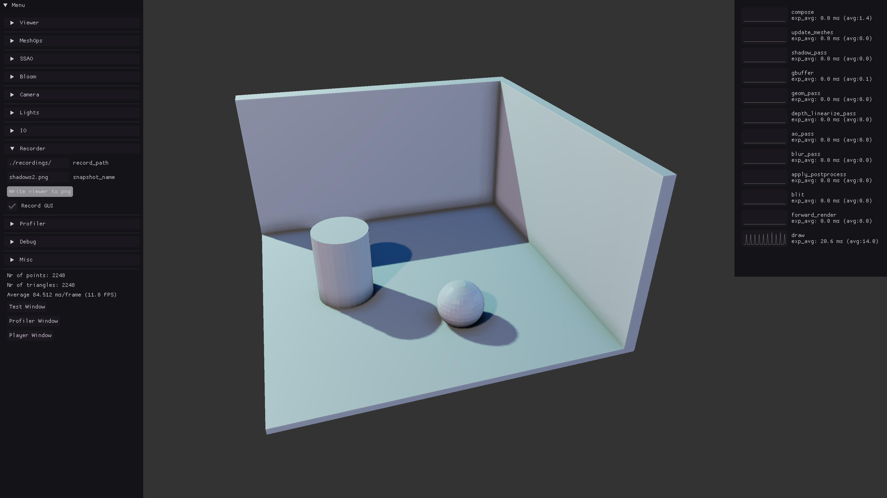

# EasyPBR

<p align="middle">
  <!--  -->
  
  <!-- <figcaption> Your text </figcaption> -->
  <!--   -->
  <!--   -->
   
  <!-- <figcaption> Your text </figcaption> -->
  <!--  -->
  
</p>

EasyPBR is a lightweight Physically-Based Renderer designed for ease of use and fast prototyping. It abstracts away most of the complexity of rendering allowing the user to display high quality images in only a couple of lines of code. By default, EasyPBR tries to choose parameters in order to best render a particular scene but if more control is needed, the whole rendering process is controllable through either a Python script or C++ program. EasyPBR is written in C++ and OpenGL and provides Python bindings to most of it's functionality.

<!--  |  -->


# Example

An example of a python3 script which shows a single mesh using the configuration stored in config/default_params.cfg:

    try:
        import torch
    except ImportError:
        pass
    from easypbr  import *

    config_file="./config/default_params.cfg"

    view=Viewer.create(config_file) 
    lucy = Mesh("./data/lucy.obj")
    Scene.show(lucy, "lucy")

    while True:
        view.update()

Alternatively, one can also start an empty viewer by using:

    ./python/empty.py


# Features
- Deferred rendering 
- Physically-based shading
- Screen Space Ambient Occlusion (SSAO)
- Shadow Mapping with Percentage Closer Filtering for soft shadows
- Image Based Lighting (IBL) using HDR maps
- Eye Dome Lighting for point cloud rendering
- Various tonemapping operators (Rheinhard, Unreal, ACES)
- Shader hotloading 
- Various modes of visualization (mesh, wireframe, point cloud, surfel)
- Loading of multiple meshes formats (.obj, .ply, .pcd, .off)
- Drag and drop of meshes and HDR maps directly in the viewer
- Easy extension and usage from other packages

# Install 
### Dependencies:
```sh
$ sudo apt-get install python3-pip python3-setuptools libglfw3-dev libboost-dev libeigen3-dev libpcl-dev libopencv-dev
```
### Optional dependencies: 
Allow for shader hotloading, so changes to .glsl files are automatically recompiled and used while the program is running:
```sh   
$ sudo apt-get install libkqueue-dev
```

### Build and install: 
```sh
$ git clone --recursive https://github.com/RaduAlexandru/easy_pbr.git
$ cd easy_pbr
$ make
```


## Examples

Various examples can be found in the ./examples folder. A short description of each one is given here. The various effects are achived through a combination of different .cfg file configurations and different setting established in the python file.

| Name  | Description |
| ------------- | ------------- |
| Deferred Physically based rendering |  Real-time rendering of a scene with 'physically-based' materials (GGX BRDF introduced in *Microfacet Models for Refraction through Rough Surfaces*, Walter et al., 2007), using deferred rendering and an HDR pipeline with bloom and SSAO. <br /> Run with [./examples/pbr.py](./examples/pbr.py) |
| Shadows and Ambient Occlusion |  <br /> Run with [./examples/shadows.py](./examples/shadows.py) |
<!-- | Bloom |   | -->
